# ShamanPower

All-in-one totem management, cooldown tracking and raid coordination for Shamans in **World of Warcraft: TBC Anniversary** — with a guided setup that shows you every feature working before you decide.

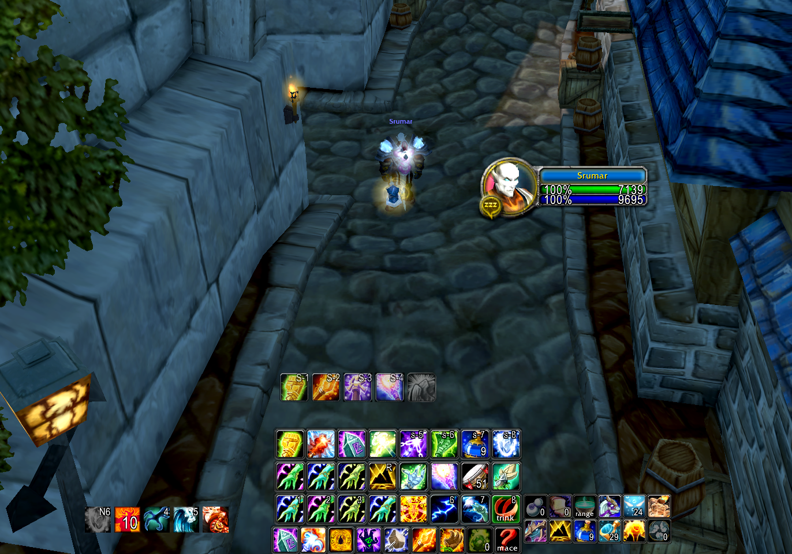

- **Totem bar** — drop, assign and twist totems from one bar with flyouts, duration bars, pulse timers and cooldown swipes. Three display styles: Normal, TotemTimers-style and Dynamic (PvP)
- **Cooldown bar** — shield charges and flyout, weapon imbues, Ankh, Nature's Swiftness, Mana Tide, Shamanistic Rage, Bloodlust/Heroism, Elemental Mastery, Totemic Call
- **Party Buff Tracker** — a dot per party member on each totem (class colour in range, red out of range) or a count, or both
- **Raid Cooldowns** — assign and call Bloodlust/Heroism, Mana Tide and Drums of Battle; the assigned player gets a big "USE … NOW" alert. Callers can be any class
- **Totem assignments** — every shaman in the group in one window, synced to everyone running the addon
- **Modules** — Earth Shield Tracker, Shield Charges, Reactive Totems, Tremor Reminder, Expiring Alerts, Totem Range (all classes), Totem Plates (all classes)
- **Guided setup, sharing, presets** — `/spsetup` walks you through everything with live previews; profiles export as a copyable string; a complete built-in layout can be previewed and applied in one click

## Guided setup

The first time you log in on a Shaman, ShamanPower opens a setup that walks through every feature with a live preview — pick your spec, and each step shows the real thing working (totems dropping, bars running down, alerts firing) with the actual options next to it. Nothing is applied until you change it. Run it again any time with `/spsetup`.

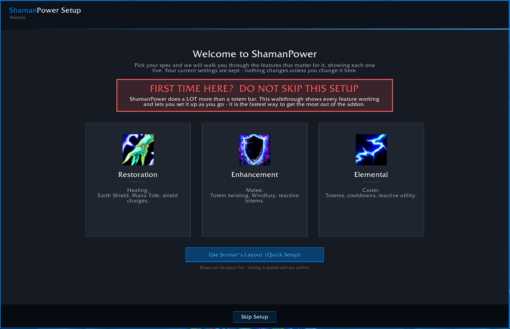

| | |
|---|---|
| 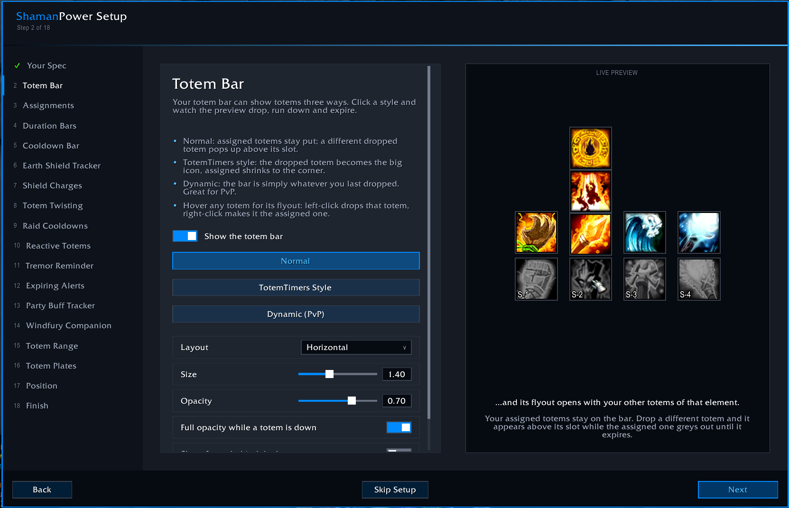 Every step: options on the left, live preview on the right | 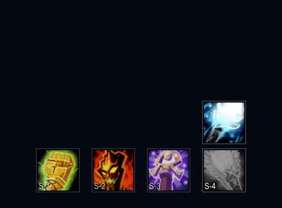 The preview drops, runs down and expires for real |

## Requirements

- TBC Anniversary client (2.5.x). Vanilla and Wrath clients are not supported.
- The `ShamanPower_Config` module is required for the settings window and the guided setup. The other modules are optional and can be disabled individually in the AddOns list.

## Installation

1. Download `ShamanPower-x.y.z.zip` from the [Releases page](https://github.com/taubut/ShamanPower/releases).
2. Extract **all** of the folders inside it (`ShamanPower`, `ShamanPower_Config`, `ShamanPower_ESTracker`, …) into `World of Warcraft/_anniversary_/Interface/AddOns/`.
3. Restart the game (a `/reload` is not enough for a first install).
4. Log in on a Shaman — the guided setup opens by itself. Run it again any time with `/spsetup`.

Upgrading from 1.x: your settings are kept. You will be offered a short tour of what is new; taking it never changes anything you have not chosen to change, and applying a built-in layout backs your setup up first (Settings > Profiles > Built-in Layouts > Restore My Previous Setup).

## Quick start

| Command | What it does |
|---|---|
| `/sp` (or `/spui`) | Settings window |
| `/spsetup` | Guided setup |
| `/sp totems` or `/spa` | Totem assignments window |
| `/spraid` | Raid cooldown assignments |
| `/sprange` | Totem Range overlay |
| `/spl <name>` | Switch totem loadout |

Right-clicking the minimap icon opens the settings; left-click opens the assignments window.

## Screenshots

| | |
|---|---|
| 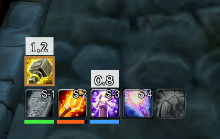 Normal style: a dropped totem pops up above its slot | 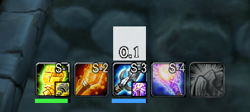 TotemTimers style: the dropped totem becomes the big icon |
| 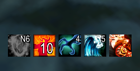 Cooldown bar | 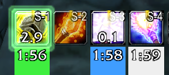 Pulse timers and duration text |
| 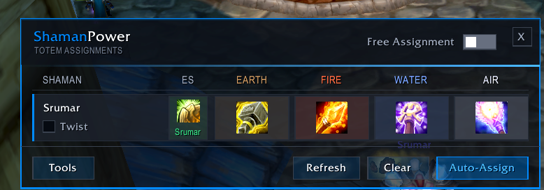 Totem assignments | 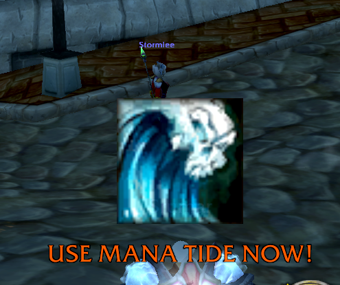 What the called shaman sees |
| 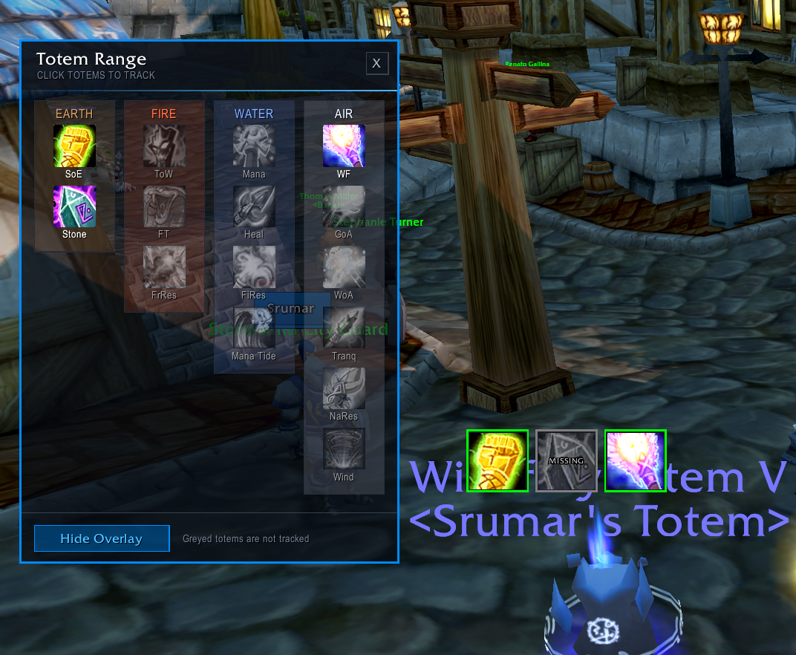 Totem Range picker and overlay | 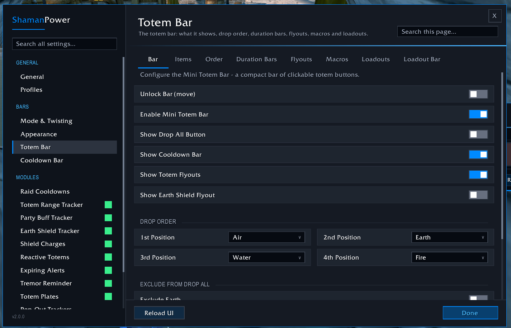 Settings window |

## Features in more detail

**Totem bar** — left-click drops, right-click destroys; hover a slot for a flyout of every totem of that element (click to drop, right-click to make it the assigned one). Drop All button and per-element keybinds, auto-updating macros, totem loadouts with an on-screen loadout bar, duration bars and text, pulse timers, totem cooldown swipes (radial or vertical), horizontal or vertical layout, scale, opacity, unlock-and-drag positioning.

**Totem twisting** — alternate Windfury with Grace of Air or Wrath of Air; a countdown on the Air slot shows when to drop Windfury again, with an optional warning sound.

**Cooldown bar** — every item can be turned off or reordered; progress bars, vertical or radial sweep, time-remaining text; floats free of the totem bar.

**Party Buff Tracker** — dots in the icon corners or in a row/column around it, with an outline so they read on bright icons; numbers on the icon or in separate movable frames. Windfury on other players cannot be seen by addons — the **Windfury Companion** WeakAura (Settings > Windfury Companion) fixes that for your melee.

**Earth Shield Tracker / Shield Charges** — every Earth Shield in the raid with target, caster and charges; big on-screen numbers for your shield and Earth Shield charges.

**Raid Cooldowns** — assign Bloodlust/Heroism, a Mana Tide caller per group and a Drums of Battle drummer per group. One-press caller buttons; anyone with control can call, but callers need ShamanPower installed too.

**Reactive Totems** — big alerts the moment someone is feared, poisoned or diseased, telling you which totem fixes it.

**Tremor Reminder** — target a known fear-caster and a reminder appears before anyone gets feared; 40+ TBC mobs built in, add your own.

**Expiring Alerts** — scrolling-combat-text alerts when a shield runs out, a totem is destroyed or expires, or a weapon imbue fades.

**Totem Range** (any class) — green / red / gray per totem: in range, out of range, nobody has it down. Appears automatically when a shaman is in your group.

**Totem Plates** (any class) — enemy totem nameplates replaced with big icons so you can kill the Grounding or Tremor instantly; pulse countdown on pulsing totems.

## Not a Shaman?

Install it anyway. Other classes get a short tailored setup covering Totem Range, Raid Cooldowns (raid leaders and assistants can call their shamans' cooldowns), the Windfury Companion (for melee) and Totem Plates. Shaman-only settings are greyed out.

## Sharing setups

Settings > Profiles can export the current profile — every setting, position and module — as a copyable `SP1:` string, and import one live as a new profile. A complete built-in layout is available under Profiles > Built-in Layouts (and as Quick Setup in the guided setup); it is previewed before it is applied and your previous setup is backed up automatically.

## Modules

| Folder | Purpose | Required |
|---|---|---|
| `ShamanPower` | Core: totem bar, cooldown bar, assignments engine, twisting, loadouts, macros | yes |
| `ShamanPower_Config` | Settings window, guided setup, assignments window, sharing | yes |
| `ShamanPower_PartyRange` | Party Buff Tracker | optional |
| `ShamanPower_RaidCooldowns` | Raid cooldown callers and alerts | optional |
| `ShamanPower_ESTracker` | Earth Shield Tracker | optional |
| `ShamanPower_ShieldCharges` | Shield charge numbers | optional |
| `ShamanPower_ReactiveTotems` | Fear / poison / disease alerts | optional |
| `ShamanPower_TremorReminder` | Fear-caster reminder | optional |
| `ShamanPower_ExpiringAlerts` | Expiry alerts | optional |
| `ShamanPower_SPRange` | Totem Range overlay (any class) | optional |
| `ShamanPower_TotemPlates` | Totem nameplate icons (any class) | optional |

## Issues and feedback

Bugs and requests: [GitHub Issues](https://github.com/taubut/ShamanPower/issues). If a preview or feature misbehaves, enable `/console scriptErrors 1` (or BugSack) and include the error text.

## Credits

- Author: Srumar (taubut)
- ShamanPower started life as a shaman adaptation of [PallyPower](https://www.curseforge.com/wow/addons/pallypower) and has since been rewritten from the ground up

## License

GNU General Public License v2 or later — see [LICENSE.txt](LICENSE.txt). Bundled libraries follow their own licenses.
